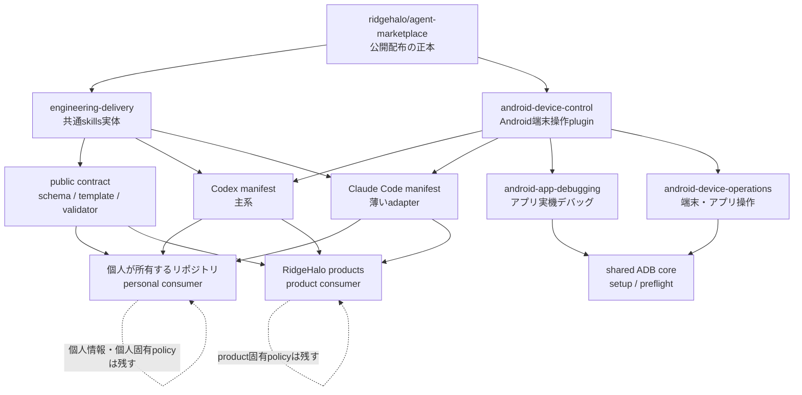

# アーキテクチャ

## 推奨構成

## 設計判断

### marketplaceはRidgeHaloに置く

配布物の所有者をRidgeHaloにし、個人が所有するリポジトリを一利用者にします。これにより、個人固有の文脈と第三者がcloneできる公開契約を分離できます。

### Codex-first、skills single-source

`.codex-plugin/plugin.json` と `.agents/plugins/marketplace.json` を主系の配布契約にします。Claude Codeは `.claude-plugin/` manifestから同じ `plugins/<name>/skills/` を配布します。skill本文をplatform別に二重管理しません。

### platform固有capabilityは分離する

hooks、MCP、subagents、認証、permission設定はskill本文へ埋め込まず、必要になった時点でplatform adapterとして設計します。追加前には権限、停止条件、rollbackをHuman Gateで確認します。

`android-device-control` はADBを外部依存として呼び出すskills-only pluginです。アプリ開発者向けの`android-app-debugging`と、利用者が明示した設定・アプリ・移行操作向けの`android-device-operations`を分け、接続setupとfail-closed preflightだけを共有します。ADB binary、端末driver、接続認証、常駐processは配布物へ含めません。

公開pluginには再利用できる操作原則と安全境界だけを置きます。個人の端末識別子、アカウント、操作履歴、サービス固有の移行対象はLifeなどの利用側が実行時に与えます。これにより、個人Marketplaceを別に持たず、RidgeHalo Marketplaceを単一の配布元として複数consumerから利用できます。

### contractとconsumer stateを分離する

公開coreはschema、template、validator、compilerだけを提供します。personal / product consumerは同じcontract versionをpinしますが、profile、Project field、private state storeを共有しません。外部stateはsource revisionと観測時刻を持つread-only projectionとして解決します。

### 利用側policyを優先する

共通skillはbranch、検証、read-backなどの不変条件だけを持ちます。Project URL、status名、priority、commit言語、required checksなどは利用リポジトリの指示へ残します。

## 信頼境界

| 境界 | 規則 |
| --- | --- |
| marketplace登録 | catalogが見えるだけ。全pluginを暗黙に導入しない |
| plugin導入 | skills-only。外部権限や端末アクセスを付与しない |
| Android端末 | 利用者が許可したADB接続だけを使い、曖昧な端末・package・account・build・操作対象では停止する |
| repo write | ユーザー依頼と対象repo policyの範囲に限定する |
| external write | 実行前に対象と変更内容を確定し、実行後にread-backする |
| public release | secret scan、manifest検証、clean clone検証後だけtagを作る |
| cross-domain projection | source revision / observed time必須。raw private stateを複製しない |
| promotion | allowed fields / redaction class / approval recordを固定する |
| terminal reporting | 必須Actionと任意提案を分離し、操作不要時も固定見出しを残す |

## 失敗時の原則

- `all` targetは全CLIのpreflight後に実行する。実行途中のfailureでは既完了状態を自動削除せず、read-backして安全に再実行する
- install成功と認識成功を分ける
- 認識状態を読めないtargetは `unverified` とする
- 利用側の既存skillはcutover承認まで残す
- publicからprivateへ戻しても既存cloneは回収できない前提で公開前検査を行う
